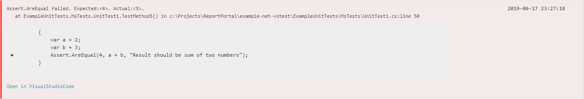

Install `ReportPortal.Extensions.SourceBack` nuget package into tests project and see in report where exactly test was failed.

# How it works
This package embedds your tests source code into `pdb` file. When test fails, `sourceback` package tracks exceptions stacktrace and inserts corresponding piece of code. This works even if you build and execute tests on different machines.

# Requirements
For Windows projects you need to change `Debug Type` for your project to `portable` or `embedded`. To do it: right click on the project -> Properties -> Build -> Advanced -> Debugging Information.

`portable` debug type is already set for most of projects.
